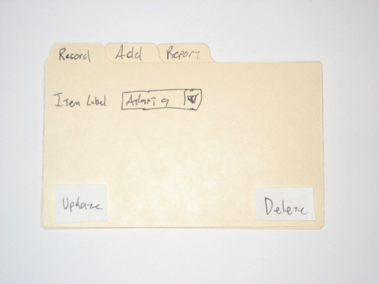
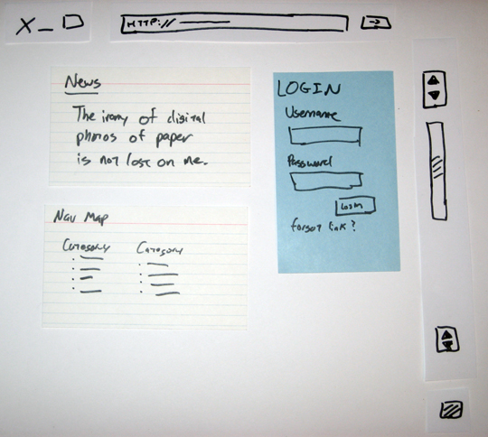

!SLIDE

# Paper Prototyping
## aka "My kid could do that"

!SLIDE
# Me
Kyle Shipley

You Jane.

!SLIDE bullets
# Why
* You're lazy
  
Coding is hard.

* You're cheap
  
Those Photoshops are expensive.

* People are too nice
  
You're always saying that, right?

.notes You need a library for that AJAX-y behavior, and which gem should you use?

!SLIDE bullets
# Tools
* Paper
* Marker / Pen
* Index cards / Post-Its
  
For the more refined palate

!SLIDE
# Don't overthink it.

The cost of iteration is low.

!SLIDE
# Things will change.

You gotta keep 'em separated.

!SLIDE
# Be creative!

Mix and match.

!SLIDE
# Examples

!SLIDE
# Tabs and drop-down

(http://www.alistapart.com/articles/paperprototyping/)

!SLIDE
# Tabs and drop-down

(http://www.alistapart.com/articles/paperprototyping/)

!SLIDE
# Login

(http://www.alistapart.com/articles/paperprototyping/)

!SLIDE
# Login

(http://www.alistapart.com/articles/paperprototyping/)

!SLIDE
# Login

(http://www.alistapart.com/articles/paperprototyping/)

!SLIDE
# Pop up

(http://www.alistapart.com/articles/paperprototyping/)

!SLIDE

(http://desperatelyseekingvalidation.com/blog/2011/06/may-2011-customer-discovery-day/)

!SLIDE
# Cons
* Ephemeral
  
I'm actually okay with this.

* Still too concrete
  
You might end up prematurely optimizing.

* Sucks for distributed teams
  
Try something like Balsamiq Mockups.

!SLIDE
# Balsamiq Mockups

Cheaper than Photoshop, but still $79. They were nice to Quipol, though.

!SLIDE
# Resources
* [Paper Prototyping by Carolyn Snyder](http://www.amazon.com/Paper-Prototyping-Interfaces-Interactive-Technologies/dp/1558608702)
  
(I haven't read it yet, but it's supposed to be good.)

* [A List Apart](http://www.alistapart.com/articles/paperprototyping/)
* [Desperately Seeking Validation](http://desperatelyseekingvalidation.com/blog/2011/06/may-2011-customer-discovery-day/)